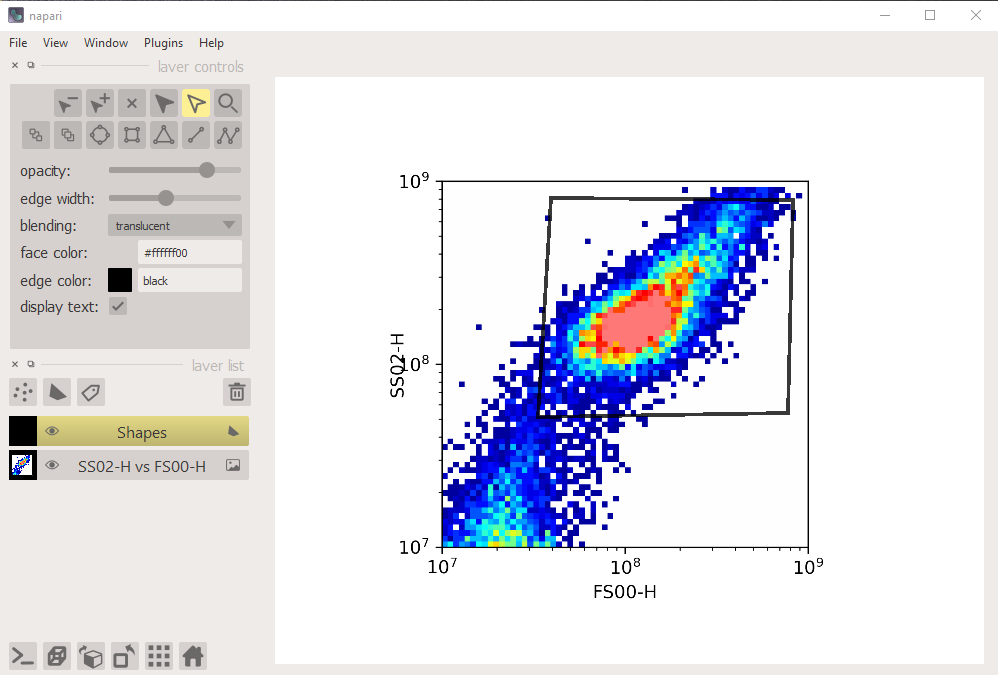

## napari_jflowcyte 0.0.3
These files are intended to provide tools to read and write flow cytometry (fcs) files and perform interactive gating in Napari (https://napari.org).

FCS file IO is accomplished with importflowcyte and exportflowcyte.  In the former, getFCSFile(path) returns a list of channel names, an multidimensional array of column values, and a 2D array of metadata.  Note that compensateflowcyte has convenience methods getFileAsDF (takes the output of getFCSFile) and getFileAsDF2 (takes the path directly) that return a pandas dataframe with appropriate column labels and a metadata dictionary for easy reference.  The exportflowcyte module has write_data which takes the path and the getFCSFile objects and writes a FCS file.  As above, compensateflowcyte has saveDF which accomplishes the same tasks from the dataframe and metadata dictionary.

In addition to the above mentioned tasks, the compensateflowcyte module will pull the spillover matrix from the FCS file header ("SPILLOVER" metadata key) with and perform compensation, returning the compensated dataframe.  The function getCompensated does this from the file path while compensateColumns does the actual compensation.

# Gating

Gating polygon generation is performed in the Napari user interface with helper functions in the gateflowcyte module.  Pairs of columns are plotted in 2D histograms with the addNapariHist function which takes a dataframe, x and y column names, plot limits list (xmin,xmax,ymin,ymax), log axis boolean values list, and the napari viewer object (if None it creates a new one).  Please see the "compensate_gate_hek" notebook in the tests folder for an example of usage.  The optional multiplier argument saturates the histogram to make it easier to see low frequency bins (multiplier = 2 will saturate at half the maximum bin value).  Gates are hand drawn with the Napari polygon tool and brought back into python with the viewer.layers[layeridx].data[0] object. Here is a screenshot of a histogram shown in Napari with a polygon gate drawn:

A boolean array indicating events inside the gate is obtained with the plotGateContains function which must recieve the same limits and log arguments as the addNapariHist function (other limit/log values will result in the incorrect gate being applied).  If you want an overlay reference image showing the gate position, it can be generated with the overlayImageGate function which takes the figure image output by addNapariHist and the gate coordinates.

Once all gates are generated for a single file, they can by applied to other files without the interactive process described here as demonstrated by the "batch_compensate_hek" notebook in the tests folder.